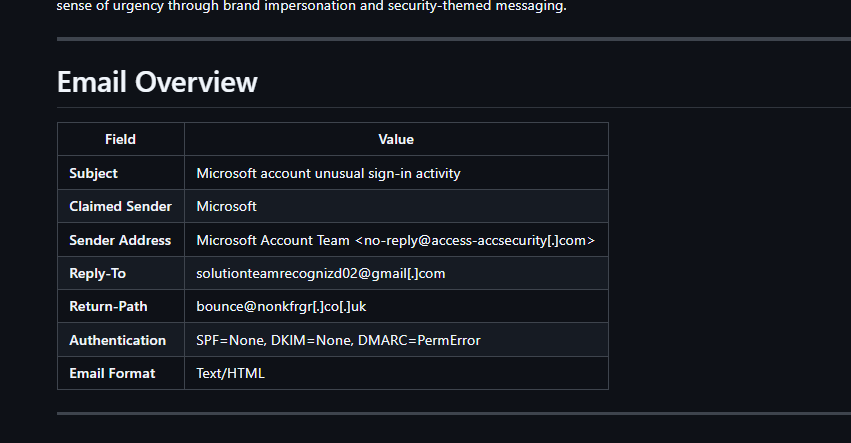
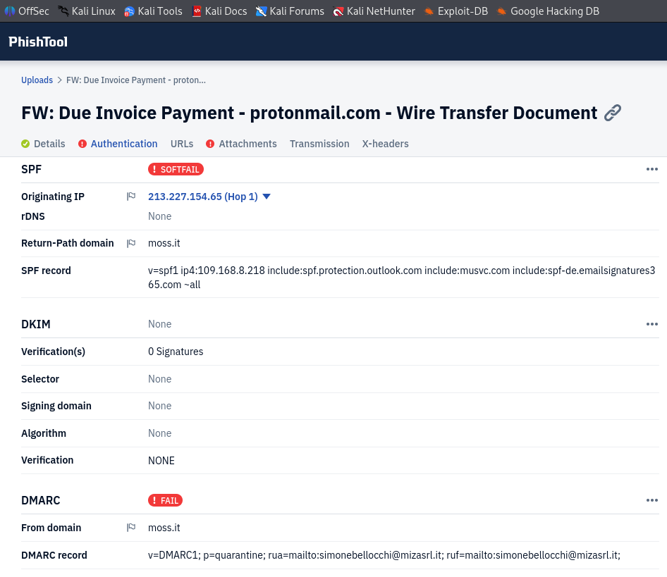
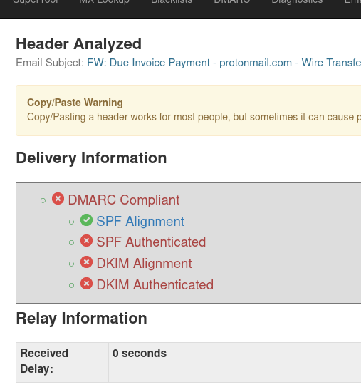
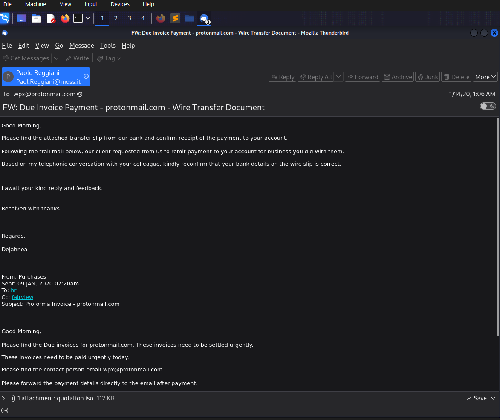
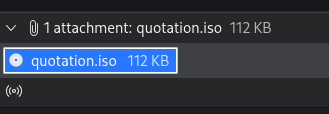
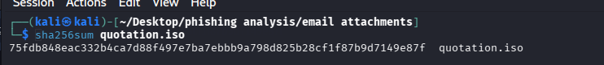
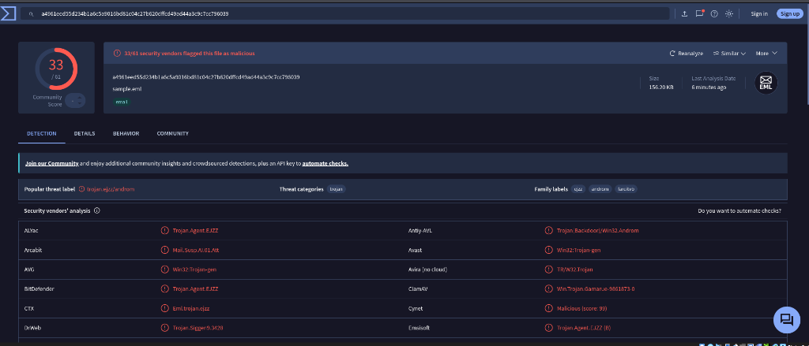
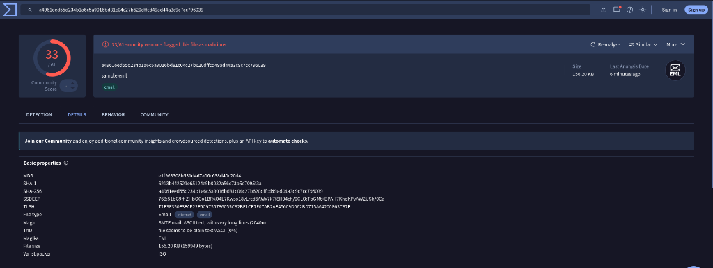
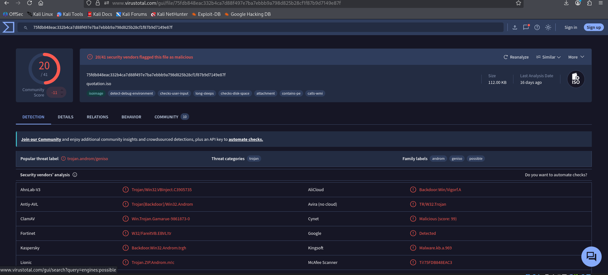
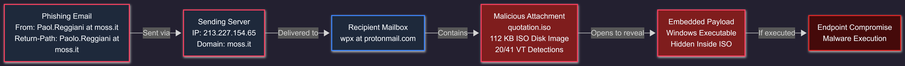

# 🔬 CASE-001: Malicious ISO Attachment Phishing Investigation

[← Back to Main Repository](../README.md)

---

## Case Summary

This investigation examined a phishing email that utilized an urgent invoice and wire-transfer payment lure to trick the recipient into downloading and opening a malicious ISO disk-image attachment (`quotation.iso`). 

The email failed sender authentication checks, contained character-level discrepancies between the visible sender and the envelope return-path, and delivered an ISO payload detected by **20 out of 41 antivirus engines** on VirusTotal.

> [!IMPORTANT]
> **Defanging Notice:** All Indicators of Compromise (IOCs), IP addresses, URLs, and domains in this report have been defanged (e.g., replacing `.` with `[.]`, `http` with `hxxp`) to prevent accidental navigation or execution.

| Field | Details |
|---|---|
| **Final Verdict** | 🔴 Malicious Attachment Phishing / Malware Delivery |
| **Severity** | High |
| **Confidence** | High |

---

## Email Overview

| Field | Value |
|---|---|
| **Subject** | `FW: Due Invoice Payment - protonmail.com - Wire Transfer Document` |
| **Claimed Sender** | Paol.Reggiani |
| **Sender Address** | `Paol.Reggiani@moss[.]it` |
| **Return-Path** | `Paolo.Reggiani@moss[.]it` |
| **Recipient** | `wpx@protonmail[.]com` |
| **Originating IP** | `213[.]227[.]154[.]65` |
| **Message-ID** | `20200114000605.14E3983143C82AAA@moss[.]it` |
| **Authentication** | SPF=Softfail, DKIM=None, DMARC=Fail |
| **Attachment** | `quotation.iso` (112 KB ISO disk image) |

---

## Evidence Preservation & Hashes

Before analyzing the email structure, the raw `sample.eml` file was preserved and hashed in Kali Linux to establish chain of custody:

 

---

## Header & Sender Analysis

Examining the raw MIME headers in Thunderbird and parsing them via PhishTool and MXToolbox revealed several critical sender anomalies and authentication failures:

### 1. Visible Sender vs. Return-Path Mismatch
- **Visible `From`:** `Paol.Reggiani@moss[.]it`
- **Envelope `Return-Path`:** `Paolo.Reggiani@moss[.]it`

Notice the single-character discrepancy (`Paol` vs `Paolo`). This character-level difference suggests improper manual configuration by the threat actor or an attempt to bypass naive keyword filters.

### 2. Email Authentication Results
- **SPF (Sender Policy Framework):** `Softfail` — The sending IP address `213[.]227[.]154[.]65` was not listed in the SPF record for `moss[.]it`.
- **DKIM (DomainKeys Identified Mail):** `None` — The email lacked a cryptographic DKIM signature.
- **DMARC (Domain-based Message Authentication):** `Fail` — Because SPF failed alignment and DKIM was absent, DMARC failed validation.

### 3. Originating Infrastructure Tracing
Tracing the `Received` headers from the recipient (`wpx@protonmail[.]com`) back to the originating server identified `213[.]227[.]154[.]65` as the earliest external relay hop.

 

  

---

## Social Engineering & Body Analysis

The email was formatted as a forwarded message (`FW: Due Invoice Payment...`) to create artificial familiarity and trust. 

### Key Persuasion Tactics:
- **Financial Urgency:** Implying an overdue invoice and pending wire transfer payment to pressure prompt action.
- **Authority Impersonation:** Pretending to represent an established Italian business (`moss[.]it`).
- **Attachment Lure:** Instructing the recipient to open the attached quotation to process the wire transfer.

 

---

## Attachment & Payload Analysis

The email delivered a 112 KB file named `quotation.iso`. 

> [!NOTE]
> **Why Attackers Use ISO Files:** Modern email gateways frequently block `.exe`, `.scr`, or `.vbs` files. Attackers wrap executable payloads inside container formats like `.iso` or `.img` because Windows 10/11 automatically mounts ISO files upon double-clicking without requiring third-party archive software, allowing embedded executables to run directly.

 

  

### Cryptographic Hashes

#### Evidence File (`sample.eml`)
- **MD5:** `e1f968308b531d467a06c638d40c20d4`
- **SHA-1:** `6213b442521e65124e9b0032a56c73b5e7095f3a`
- **SHA-256:** `a4961eed55d234b1a6c5a9016bd81c04c27b620dffcd49ad44a3c9c7cc796039`

#### Attachment Payload (`quotation.iso`)
- **MD5:** `6aef1d7f88e8aa450a0c604b4caee5ba`
- **SHA-1:** `3fe45f8cd20cd7c63e55e3918dac1d3a0d7fb05a`
- **SHA-256:** `75fdb848eac332b4ca7d88f497e7ba7ebbb9a798d825b28cf1f87b9d7149e87f`

---

### Threat Intelligence & Reputation Analysis

Querying both the raw `.eml` sample and extracted payload on VirusTotal yielded strong malicious consensus across security vendors:

1. **Evidence File (`sample.eml`):** **33 out of 61 security vendors** flagged the raw email sample as malicious, tagging it under threat label `trojan.ejzz/androm` (Trojan.Agent.EJZZ, Win32:Trojan-gen).
2. **Payload Container (`quotation.iso`):** **20 out of 41 security vendors** flagged the extracted ISO attachment as a Trojan/Downloader.

 

  

  

---

## Attack Infrastructure Map

 

| Infrastructure Component | Details | Assessment |
|---|---|---|
| **Sending Domain** | `moss[.]it` | Claimed Italian business domain (compromised or spoofed) |
| **Sending IP** | `213[.]227[.]154[.]65` | External sending MTA infrastructure |
| **Envelope Sender** | `Paolo.Reggiani@moss[.]it` | Discrepant Return-Path address |
| **Attachment** | `quotation.iso` | Malicious ISO disk image (20/41 VT detections) |

---

## Indicators of Compromise

All indicators are defanged for safe sharing:

| Type | Defanged IOC | Source | Confidence | Recommended Action |
|---|---|---|---|---|
| SHA-256 | `75fdb848eac332b4ca7d88f497e7ba7ebbb9a798d825b28cf1f87b9d7149e87f` | Attachment | High | Block hash across EDR & Mail Gateway |
| SHA-1 | `3fe45f8cd20cd7c63e55e3918dac1d3a0d7fb05a` | Attachment | High | Add to SIEM blocklist |
| MD5 | `6aef1d7f88e8aa450a0c604b4caee5ba` | Attachment | High | Add to AV signature list |
| IPv4 | `213[.]227[.]154[.]65` | Header | Medium | Search mail gateway logs |
| Email | `Paol.Reggiani@moss[.]it` | From | Medium | Block sender address |
| Email | `Paolo.Reggiani@moss[.]it` | Return-Path | Medium | Block envelope sender |
| Domain | `moss[.]it` | Header | Contextual | Monitor & verify sender legitimacy |

---

## MITRE ATT&CK Mapping

| Tactic | ID | Technique | Observed In | Evidence & Context |
|---|---|---|---|---|
| **Initial Access** | [T1566.001](https://attack.mitre.org/techniques/T1566/001/) | Phishing: Spearphishing Attachment | Case 001 | Delivered a malicious `quotation.iso` container attachment via email |
| **Execution** | [T1204.002](https://attack.mitre.org/techniques/T1204/002/) | User Execution: Malicious File | Case 001 | Requires the victim to mount the ISO and execute the embedded Trojan payload |
| **Defense Evasion** | [T1204.002](https://attack.mitre.org/techniques/T1204/002/) | Container Files | Case 001 | Wrapping Windows `.exe` payload inside an ISO disk image to bypass gateway scanning |
| **Defense Evasion** | [T1036](https://attack.mitre.org/techniques/T1036/) | Masquerading | Case 001 | Disguised malicious executable as a wire transfer invoice quotation from `Paol.Reggiani@moss[.]it` |
| **Resource Development** | [T1584](https://attack.mitre.org/techniques/T1584/) | Compromised Infrastructure | Case 001 | Leveraging external business mail server (`mail.moss[.]it` / `213[.]227[.]154[.]65`) for dispatch |

---

## Containment & Response Recommendations

1. **Immediate Email Gateway Blocks:**
   - Quarantine all incoming messages from `Paol.Reggiani@moss[.]it` and `Paolo.Reggiani@moss[.]it`.
   - Add SHA-256 hash `75fdb848eac332b4ca7d88f497e7ba7ebbb9a798d825b28cf1f87b9d7149e87f` to global mail attachment blocklists.
2. **SIEM Telemetry Hunting:**
   - Query mail logs for Message-ID `20200114000605.14E3983143C82AAA@moss[.]it` and originating IP `213[.]227[.]154[.]65`.
   - Search endpoint telemetry for process creation events spawning from mounted ISO images.
3. **Gateway File Filtering Policy:**
   - Restrict or flag container attachments (`.iso`, `.img`, `.vhd`) arriving via external email.

---

> ℹ️ *Note: Hands-on phishing investigation and evidence analysis conducted manually. Markdown documentation, layout, and formatting refined with AI assistance.*

[← Back to Main Repository](../README.md)
