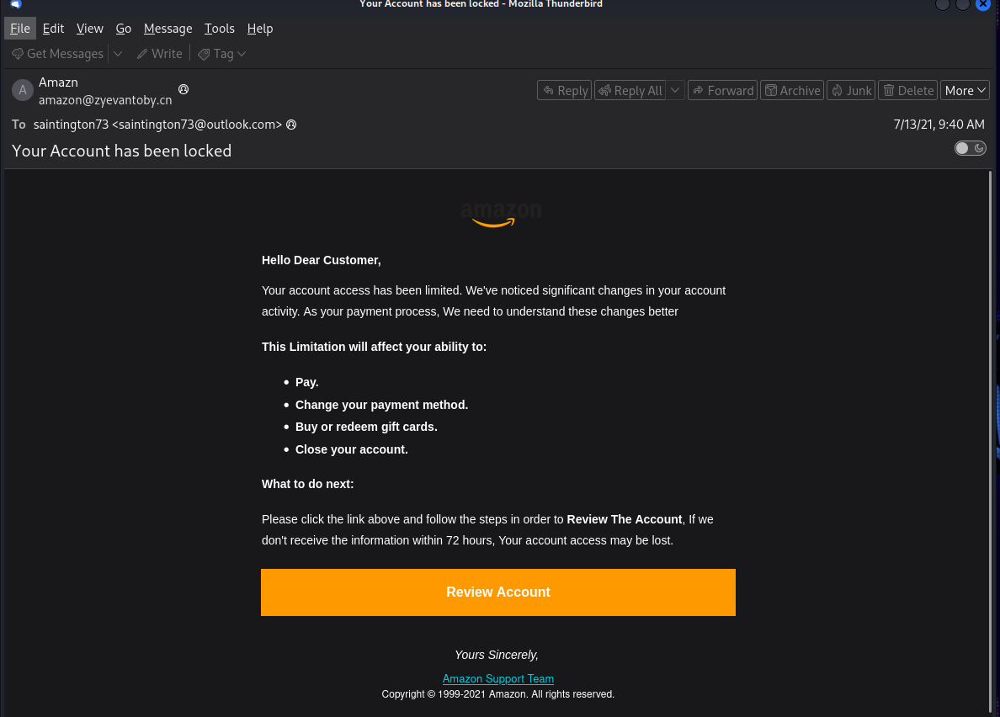
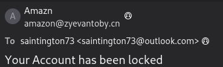
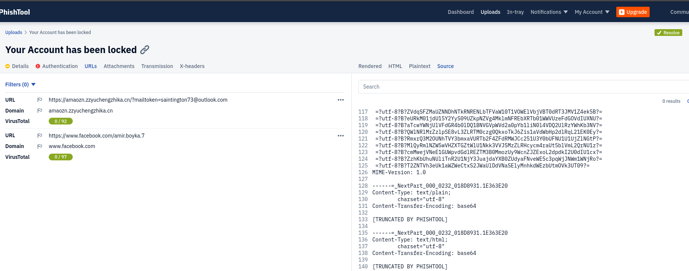
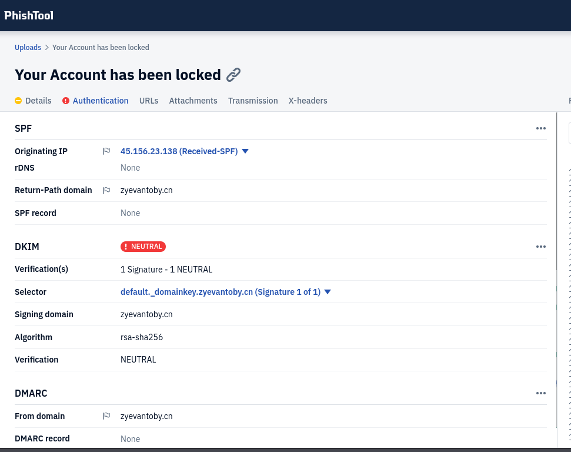
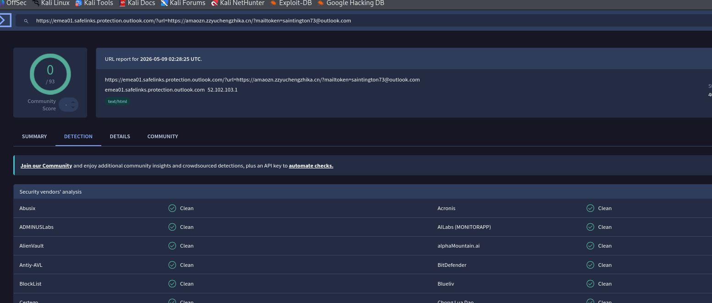
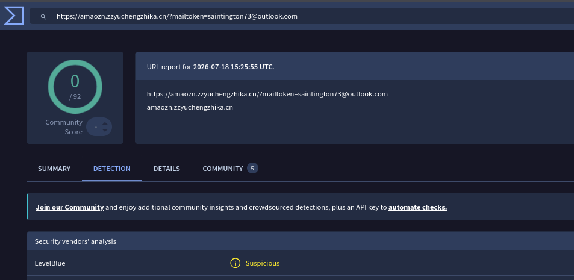
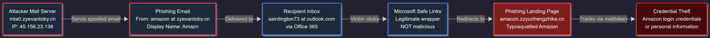

# 🔬 CASE-002: Amazon Account-Lock Phishing Investigation

[← Back to Main Repository](../README.md)

---

## Case Summary

This investigation analyzed a targeted phishing email impersonating Amazon customer support. The email claimed the recipient's account had been locked due to suspicious activity and threatened permanent account loss within 72 hours if the recipient did not immediately verify their identity via an embedded **Review Account** button.

Technical analysis confirmed that the email originated from an untrusted Chinese domain (`zyevantoby[.]cn`), failed authentication checks, and routed victims to a typosquatted credential-harvesting domain (`amaozn[.]zzyuchengzhika[.]cn`) equipped with recipient tracking tokens.

> [!IMPORTANT]
> **Defanging Notice:** All Indicators of Compromise (IOCs), IP addresses, URLs, and domains in this report have been defanged (e.g., replacing `.` with `[.]`, `http` with `hxxp`) to prevent accidental navigation or execution.

| Field | Details |
|---|---|
| **Final Verdict** | 🔴 Phishing — Credential Harvesting |
| **Severity** | High |
| **Confidence** | High |

---

## Email Overview

| Field | Value |
|---|---|
| **Subject** | `Your Account has been locked` |
| **Claimed Sender** | Amazn |
| **Sender Address** | `amazon@zyevantoby[.]cn` |
| **Return-Path** | `amazon@zyevantoby[.]cn` |
| **Recipient** | `saintington73@outlook[.]com` |
| **Originating IP** | `45[.]156[.]23[.]138` (`mta0[.]zyevantoby[.]cn`) |
| **Message-ID** | `<000756bf516d$9bad2034$6e617fb$@vinuquo>` |
| **Authentication** | SPF=None, DKIM=Neutral, DMARC=None |
| **Primary Vector** | Malicious Phishing Link |

---

## Header & Sender Infrastructure Analysis

Inspecting the raw MIME headers via Thunderbird and PhishTool revealed several critical indicators of compromise and sender spoofing:

### 1. Sender Domain Mismatch
- **Display Name:** `Amazn` (Misspelled brand name)
- **From Address:** `amazon@zyevantoby[.]cn`
- **Return-Path:** `amazon@zyevantoby[.]cn`

While the local part contained the word `amazon`, the domain `zyevantoby[.]cn` is a Chinese top-level domain completely unaffiliated with Amazon.

### 2. Message-ID Anomaly
- **Message-ID:** `<000756bf516d$9bad2034$6e617fb$@vinuquo>`

The Message-ID host (`vinuquo`) did not match the sender domain (`zyevantoby[.]cn`), indicating inconsistent or misconfigured attacker infrastructure.

### 3. Email Authentication Results
- **SPF:** `None` — No SPF record was published for the sending domain.
- **DKIM:** `Neutral` — Signature was present but failed validation pass.
- **DMARC:** `None` — No DMARC record or enforcement policy was detected.

### 4. Received Header Tracing
Tracing Received headers back through Microsoft Office 365 identified the initial external sending Mail Transfer Agent (MTA):
- **Sending MTA Host:** `mta0[.]zyevantoby[.]cn`
- **Sending MTA IP:** `45[.]156[.]23[.]138`

 

  

  

  

---

## Social Engineering & URL Analysis

The email used classic social engineering tactics, including brand impersonation, urgent security threats, and a prominent orange call-to-action button (**Review Account**).

### Safe Links Wrapping vs. Actual Destination
The call-to-action button was wrapped by Microsoft Safe Links:
- **Safe Links Wrapper:** `hxxps://emea01[.]safelinks[.]protection[.]outlook[.]com/...`
- **Decoded Destination:** `hxxps://amaozn[.]zzyuchengzhika[.]cn/?mailtoken=saintington73@outlook[.]com`

> [!NOTE]
> **Safe Links Analysis:** Microsoft Safe Links wraps URLs to perform time-of-click inspection. However, Safe Links wrapping alone does NOT guarantee a URL is safe. Decoding revealed the underlying malicious destination.

### URL Structure Breakdown
1. **Typosquatted Subdomain:** `amaozn` — Misspelled version of `amazon` designed to deceive casual inspection.
2. **Attacker Parent Domain:** `zzyuchengzhika[.]cn` — Unrelated `.cn` domain under attacker control.
3. **Recipient Tracking Token:** `?mailtoken=saintington73@outlook[.]com` — Passes the victim's email address in the query string to pre-fill the fake login prompt and track victim interaction.

 

  

---

## Attack Infrastructure Map

 

| Infrastructure Component | Details | Assessment |
|---|---|---|
| **Sending Domain** | `zyevantoby[.]cn` | Attacker-controlled sending domain |
| **MTA Hostname** | `mta0[.]zyevantoby[.]cn` | Dedicated phishing MTA (`45[.]156[.]23[.]138`) |
| **Safe Links Wrapper** | `emea01[.]safelinks[.]protection[.]outlook[.]com` | Legitimate Microsoft security wrapper |
| **Phishing Landing Page** | `amaozn[.]zzyuchengzhika[.]cn` | Typosquatted Amazon credential-harvesting page |
| **Tracking Parameter** | `?mailtoken=saintington73@outlook[.]com` | Per-victim tracking identifier |

> **Infrastructure Note:** The threat actor utilized a two-domain infrastructure architecture: one dedicated domain for email delivery (`zyevantoby[.]cn`) and a separate domain (`zzyuchengzhika[.]cn`) for hosting the credential-harvesting landing page.

---

## Indicators of Compromise

All indicators are defanged for safe sharing:

### Actionable Attack IOCs
| Type | Defanged IOC | Source | Confidence | Recommended Action |
|---|---|---|---|---|
| URL | `hxxps://amaozn[.]zzyuchengzhika[.]cn/?mailtoken=saintington73@outlook[.]com` | Email Body | High | Block URL across web proxies & firewalls |
| Domain | `amaozn[.]zzyuchengzhika[.]cn` | URL | High | Block DNS requests |
| Domain | `zzyuchengzhika[.]cn` | Parent Domain | High | Block domain & subdomains |
| Email | `amazon@zyevantoby[.]cn` | From | High | Block email sender |
| Domain | `zyevantoby[.]cn` | Header | High | Add domain to mail gateway blocklist |
| IPv4 | `45[.]156[.]23[.]138` | MTA Header | Medium-High | Search mail logs for active campaigns |
| Hostname | `mta0[.]zyevantoby[.]cn` | Header | Medium-High | Block host |

### Contextual Indicators (Do NOT Block)
| Indicator | Reason |
|---|---|
| `emea01[.]safelinks[.]protection[.]outlook[.]com` | Legitimate Microsoft Safe Links security infrastructure |
| `www[.]facebook[.]com/amir[.]boyka[.]7` | Present in email source; contextual reference |

---

## MITRE ATT&CK Mapping

| Technique | ID | Evidence & Context |
|---|---|---|
| Spearphishing Link | [T1566.002](https://attack.mitre.org/techniques/T1566/002/) | Delivered typosquatted Amazon link via email |
| User Execution: Malicious Link | [T1204.001](https://attack.mitre.org/techniques/T1204/001/) | Coerced recipient to click Review Account button |
| Masquerading | [T1036](https://attack.mitre.org/techniques/T1036/) | Used Amazon branding, logo, and look-alike subdomain |

---

## Response & Containment Recommendations

1. **Email Gateway & DNS Containment:**
   - Block `zyevantoby[.]cn` and `zzyuchengzhika[.]cn` at the email gateway and DNS resolver level.
   - Quarantine all emails originating from `amazon@zyevantoby[.]cn`.
2. **SIEM & Log Analysis:**
   - Search mail gateway logs for Message-ID `<000756bf516d$9bad2034$6e617fb$@vinuquo>` and IP `45[.]156[.]23[.]138`.
   - Query web proxy and DNS logs for outbound requests to `amaozn[.]zzyuchengzhika[.]cn`.
3. **User Remediation (If Clicked / Submitted):**
   - Reset Amazon account password and invalidate active sessions.
   - Force password resets on any corporate/personal accounts reusing the same credentials.
   - Enable Multi-Factor Authentication (MFA).

---

> ℹ️ *Note: Hands-on phishing investigation and evidence analysis conducted manually. Markdown documentation, layout, and formatting refined with AI assistance.*

[← Back to Main Repository](../README.md)
