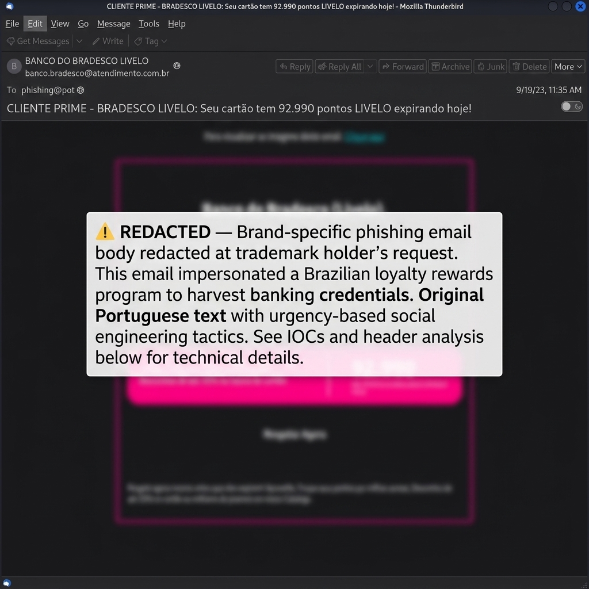
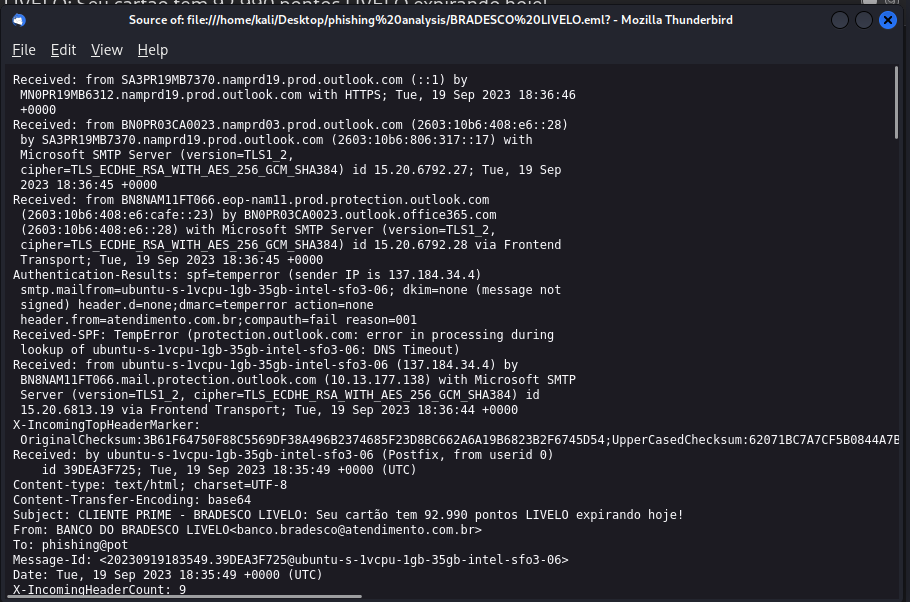
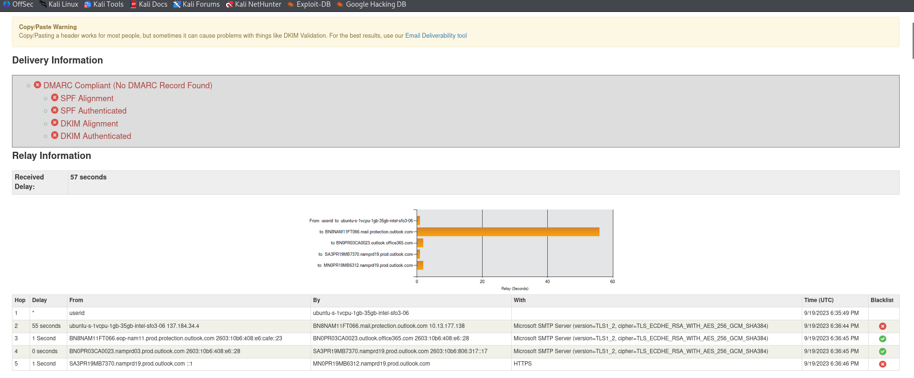
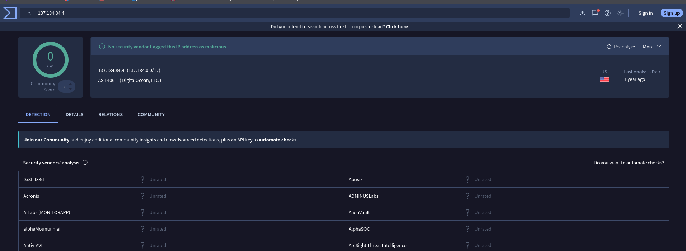
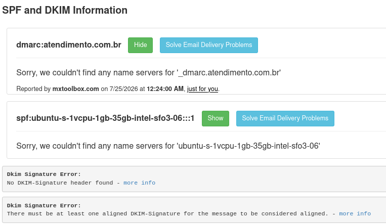
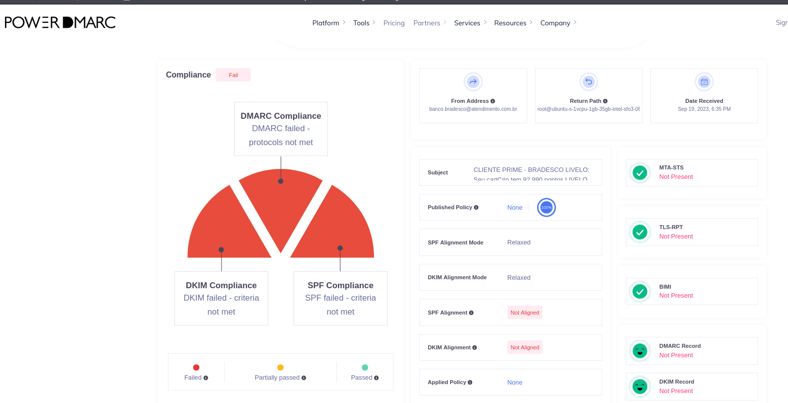
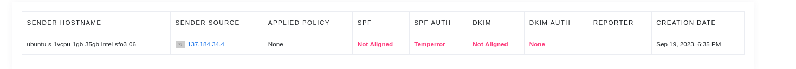

# 🔬 CASE-003: Bradesco Livelo Points Phishing Investigation

[← Back to Main Repository](../README.md)

> [!NOTE]
> **Redaction Notice:** Certain brand-specific content (email body screenshots, exact subject line text, and the raw `.eml` sample) have been redacted at the request of the trademark holder. All Indicators of Compromise, header analysis, infrastructure mapping, MITRE ATT&CK techniques, and investigative methodology remain intact for educational reference.

---

## Case Summary

This investigation analyzed a sophisticated brand-impersonation phishing email targeting customers of a major Brazilian bank and its associated loyalty rewards program. The email used urgency-based social engineering — claiming the recipient had a large number of loyalty points expiring that same day — to coerce them into clicking a link to "redeem" their points before forfeiture.

Header analysis proved the email did not originate from Bradesco, but was generated on a minimal DigitalOcean Linux VPS running Postfix as root. The decoded HTML payload routed victims to an unrelated external domain (`blog1seguimentmydomaine2bra[.]me`) designed for credential or payment information theft.

> [!IMPORTANT]
> **Defanging Notice:** All Indicators of Compromise (IOCs), IP addresses, URLs, and domains in this report have been defanged (e.g., replacing `.` with `[.]`, `http` with `hxxp`) to prevent accidental navigation or execution.

| Field | Details |
|---|---|
| **Final Verdict** | 🔴 Phishing — Brand Impersonation / Credential Theft |
| **Severity** | High |
| **Confidence** | High |

---

## Email Overview

| Field | Value |
|---|---|
| **Subject** | *(Redacted)* — Portuguese-language subject line claiming the recipient's credit card had loyalty points expiring that day, using brand impersonation of Bradesco and Livelo |
| **Claimed Sender** | BANCO DO BRADESCO LIVELO |
| **Sender Address** | `banco.bradesco@atendimento[.]com[.]br` |
| **Return-Path** | `root@ubuntu-s-1vcpu-1gb-35gb-intel-sfo3-06` |
| **Recipient** | `phishing@pot` |
| **Originating IP** | `137[.]184[.]34[.]4` (DigitalOcean AS14061) |
| **Message-ID** | `<20230919183549.39DEA3F725@ubuntu-s-1vcpu-1gb-35gb-intel-sfo3-06>` |
| **Authentication** | SPF=Temperror, DKIM=None, DMARC=Temperror |
| **Primary Vector** | Embedded Phishing Link |

<br>


---

## Header & Infrastructure Analysis

Inspecting the raw MIME headers identified critical infrastructure mismatches and server-level fingerprints:

<br>

<br><br>


### 1. Envelope Return-Path & VPS Fingerprint
- **Visible Sender:** `banco.bradesco@atendimento[.]com[.]br`
- **Envelope Return-Path:** `root@ubuntu-s-1vcpu-1gb-35gb-intel-sfo3-06`

The `Return-Path` address reveals that the email was generated on a Linux cloud server (`ubuntu-s-1vcpu-1gb-35gb-intel-sfo3-06`) using default DigitalOcean droplet naming conventions (1 vCPU, 1 GB RAM, SFO3 datacenter).

### 2. Postfix Execution as Root (`userid 0`)
The `Received` header confirmed local mail generation:
```text
Received: by ubuntu-s-1vcpu-1gb-35gb-intel-sfo3-06 (Postfix, from userid 0)
```
User ID `0` corresponds to the Linux `root` account, demonstrating that Postfix was invoked directly by the root user on the VPS to generate and send spoofed emails.

### 3. Originating IP Enrichment
- **Originating IP:** `137[.]184[.]34[.]4`
- **Autonomous System:** `AS14061 – DigitalOcean, LLC`

<br>


### 4. Authentication & Microsoft Telemetry Results
- **SPF:** `temperror` — DNS query timeout/temporary error during evaluation.
- **DKIM:** `none` — No DKIM signature present.
- **DMARC:** `temperror` — Evaluation incomplete due to SPF temperror.
- **Microsoft Antispam Score:** `X-MS-Exchange-Organization-SCL: 5` (Spam Confidence Level 5), `BCL: 9` (Bulk Complaint Level 9), marking it as unauthenticated bulk spam.

<br>

<br><br>

<br><br>


---

## URL & MIME Body Decoding

The email body utilized Base64 transfer encoding (`Content-Transfer-Encoding: base64`). 

> [!NOTE]
> **Base64 Transfer Encoding:** Base64 is standard MIME encoding used to transmit HTML/binary content over SMTP. While not inherently malicious, attackers frequently use Base64 to bypass naive string-matching filters.

Decoding the Base64 HTML content revealed that all call-to-action buttons (**Resgatar Agora / Redeem Now**, **Clique aqui / Click Here**) and image resources pointed to an external destination:
- **Decoded Destination URL:** `hxxps://blog1seguimentmydomaine2bra[.]me/`

This destination domain has no connection to Banco Bradesco (`bradesco.com.br`) or Livelo (`livelo.com.br`).

---

## Attack Infrastructure Map

<br>


| Infrastructure Component | Details | Assessment |
|---|---|---|
| **VPS Provider** | DigitalOcean AS14061 (`137[.]184[.]34[.]4`) | Cloud VPS infrastructure used for email generation |
| **VPS Hostname** | `ubuntu-s-1vcpu-1gb-35gb-intel-sfo3-06` | Default unconfigured droplet hostname |
| **Envelope Sender** | `root@ubuntu-s-1vcpu-1gb-35gb-intel-sfo3-06` | Unaligned Linux root return path |
| **Phishing Landing Page** | `blog1seguimentmydomaine2bra[.]me` | External destination domain |

---

## Indicators of Compromise

All indicators are defanged for safe sharing:

### Actionable Attack IOCs
| Type | Defanged IOC | Source | Confidence | Recommended Action |
|---|---|---|---|---|
| URL | `hxxps://blog1seguimentmydomaine2bra[.]me/` | Body Link | High | Block URL across proxies |
| Domain | `blog1seguimentmydomaine2bra[.]me` | Decoded HTML | High | Block DNS queries |
| IPv4 | `137[.]184[.]34[.]4` | MTA Header | Medium-High | Search mail gateway logs |
| Email | `banco.bradesco@atendimento[.]com[.]br` | From | Medium-High | Block sender address |
| Return-Path | `root@ubuntu-s-1vcpu-1gb-35gb-intel-sfo3-06` | Header | High | Campaign hunting |
| Hostname | `ubuntu-s-1vcpu-1gb-35gb-intel-sfo3-06` | Header | Medium-High | Hunt host in mail logs |
| Message-ID | `<20230919183549.39DEA3F725@ubuntu-s-1vcpu-1gb-35gb-intel-sfo3-06>` | Header | High | Search mailboxes for campaign spread |

### Contextual Indicator
| Indicator | Reason |
|---|---|
| `atendimento[.]com[.]br` | Visible sender domain; may be spoofed or misconfigured |

---

## MITRE ATT&CK Mapping

| Tactic | ID | Technique | Observed In | Evidence & Context |
|---|---|---|---|---|
| **Initial Access** | [T1566.002](https://attack.mitre.org/techniques/T1566/002/) | Phishing: Spearphishing Link | Case 003 | Delivered external links disguised as Portuguese Livelo point redemption |
| **Execution** | [T1204.001](https://attack.mitre.org/techniques/T1204/001/) | User Execution: Malicious Link | Case 003 | Relies on victim clicking "Redeem Now" button to harvest banking credentials |
| **Defense Evasion** | [T1036](https://attack.mitre.org/techniques/T1036/) | Masquerading | Case 003 | Impersonated Banco Bradesco and Livelo rewards program |
| **Resource Development** | [T1584](https://attack.mitre.org/techniques/T1584/) | Compromised Infrastructure | Case 003 | Dispatching email via root user on DigitalOcean VPS droplet (`ubuntu-s-1vcpu...` / `137.184.34.4`) |

---

## Response & Containment Recommendations

1. **Gateway & DNS Blocks:**
   - Block domain `blog1seguimentmydomaine2bra[.]me` across proxy, DNS, and perimeter firewalls.
   - Block incoming messages from `banco.bradesco@atendimento[.]com[.]br`.
2. **SIEM Telemetry & Campaign Hunting:**
   - Search mail logs for Message-ID `<20230919183549.39DEA3F725@ubuntu-s-1vcpu-1gb-35gb-intel-sfo3-06>` and sending IP `137[.]184[.]34[.]4`.
   - Hunt for incoming emails with envelope senders matching `root@ubuntu-s-*` droplet conventions.
3. **User Remediation (If Clicked / Submitted):**
   - Reset banking and Livelo portal credentials immediately.
   - Contact financial institution anti-fraud teams to audit account activity.

---

> ℹ️ *Note: Hands-on phishing investigation and evidence analysis conducted manually. Markdown documentation, layout, and formatting refined with AI assistance.*

[← Back to Main Repository](../README.md)
